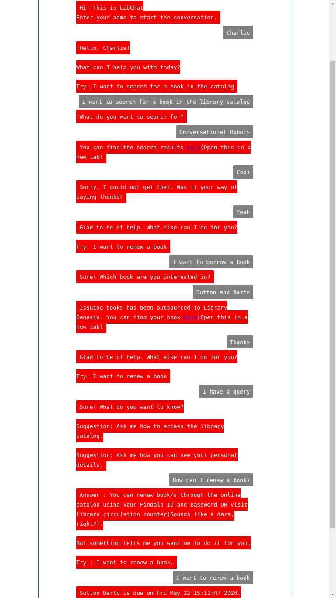

# LibChat

A key-word based chatbot for PK Kelkar Library, with issuing outsourced to Library Genesis.

### Running the bot
Run <a href = "app.py">app.py</a> and open the server link in your browser.

    $ python3 app.py

### Functions :
1. Issuing/Renewing a book
2. Searching for a book in the library catalog
3. Answering some FAQs

### Sample Conversation

 

### Dev Commands :
1. *load* : Makes the kerel learn all the aiml files.
2. *save* : Saves session and user data.
3. *boot* : Resets the context and prints the welcome message.
4. *quit* : Stops the execution. (You still need to close the browser window)