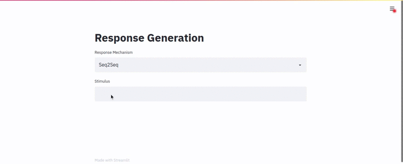
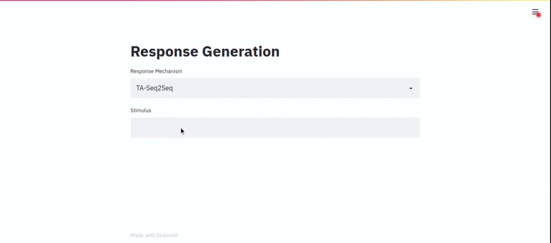

# Response Generation

Sequence-to-Sequence Model for generating responses, trained on stimulus-response samples from movie subtitiles.

Installing Required Dependencies :

```$ pip install -r requirements.txt```

## Sequence to Sequence Model

### Contents

1. [responseGeneration_keras.ipynb](responseGeneration_keras.ipynb) - Notebook for training and testing the model
2. [responseGeneration_TA.ipynb](responseGeneration_TA.ipynb) - Notebook for training the model with TA.
3. [response_generation.py](response_generation.py) - Script for loading the trained model from saved checkpoints, API for response generation with the model
4. [TA_response_generation.py](TA_response_generation.py) - Script for loading the trained TA-Seq2Seq model from saved checkpoints, API for response generation.
5. [deployment.py](deployment.py) - uses the streamlit API to generate responses through the two scripts. Can be run with :</br>
```$streamlit run deployment.py```

***

### Sample Responses

<center></center>
<center></center>

***

## References

* _Topic Aware Neural Response Generation_
  * **Link** : [https://arxiv.org/abs/1606.08340]
  * **Authors** : Chen Xing, Wei Wu, Yu Wu, Jie Liu, Yalou Huang, Ming Zhou, Wei-Ying Ma
  * **Tags** : Neural response generation; Sequence to sequence model; Topic aware conversation model; Joint attention; Biased response generation
  * **Published** : 21 Jun 2016 (v1), 19 Sep 2016 (v2)

* _Topic Modelling and Event Identification from Twitter Textual Data_
  * **Link** : [https://arxiv.org/abs/1608.02519]
  * **Authors** : Marina Sokolova, Kanyi Huang, Stan Matwin, Joshua Ramisch, Vera Sazonova, Renee Black, Chris Orwa, Sidney Ochieng, Nanjira Sambuli
  * **Tags** : Latent Dirichlet Allocation; Topic Models; Statistical machine translation
  * **Published** : 8 Aug 2016

* _Cornell Movie Dialogs_(Dataset)
  * **Link** : [https://www.cs.cornell.edu/~cristian/Cornell_Movie-Dialogs_Corpus.html]
  * **Authors** : Cristian Danescu-Niculescu-Mizil and Lillian Lee
  * **Published** : 2011
