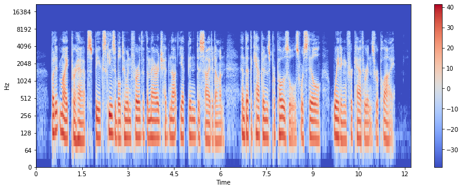
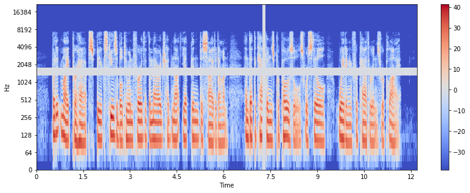

# Test Results for Phase 1

## Data Augmentation

```bash
python3 test_phase1.py --augmentation spec --audio_file_path test_audio.flac
```

**Output**:

```txt
Generating Augmentations:
Spectrogram of shape: (1025, 1050)
```



```txt
Augmented spectrogram of shape: (1025, 404)
```



## Data Generator

```bash
python3 test_phase1.py --data_gen --dataset_path LibriSpeechMini
```

**Output** :

```txt
29 Files have been found.
Reading files:[=============================](100.00%)  
Loaded dataset with shape (1519, 2)
First sample :  ['LibriSpeechMini/LibriSpeech/train-clean-5/6272/70171/6272-70171-0000.flac'
 'chapter fourteen it was sunset when we arrived in rosville and found mister morgeson waiting for us with his carriage at the station from its open sides']
Initialised Data Generator : <ds_utils.data_manip.SR_DataGenerator object at 0x7f499efaaf28>
```
