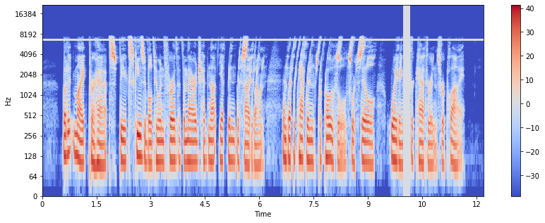

# Test Results for Phase 1

## Data Augmentation

```bash
python3 test_phase1.py test_audio.flac --augmentation spec
```

**Output**:

```txt
Generating Augmentations:
Spectrogram of shape: (1025, 1050)
```


```txt
Augmented spectrogram of shape: (1025, 404)
```


